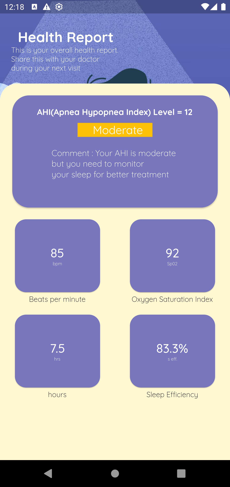

# Sleep++

Inspiration
- There have not been many disease detection projects on sleep apnea.
- One of the teammate's close relative had this disease and it was diagnosed late which makes it a difficult disease to detect.
- The symptoms are usually invisible and too generic i.e. irregular breathing, snoring and irregular sleep patterns all whcih does not necessarily definitely mean that someone has sleep apnea.

Concept
- Detect a person's breathing rate at specific intervals to dictate whether they have sleep apnea or not.

What it does 
- Uses TerraAPI to livestream the data to get the values for the breathing rate and then the program will calculate the AHI to diagnose whether a patient has sleep apnea or not.

What could come next 
- We could use other contributing factors such as ECG, age, gender, weight and height to give alerts to individuals who are at a higher risk.

Challenges
- Generated our own data from the TerraAPI documentation.
- Were not able to connect to a TerraAPI variable to livestream the data.

## Screenshots
<pre>
       

</pre>
